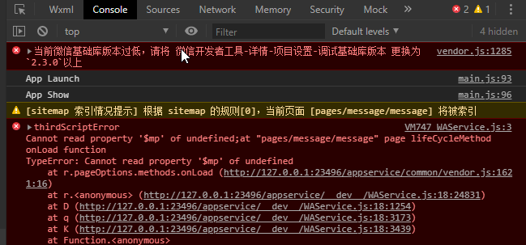
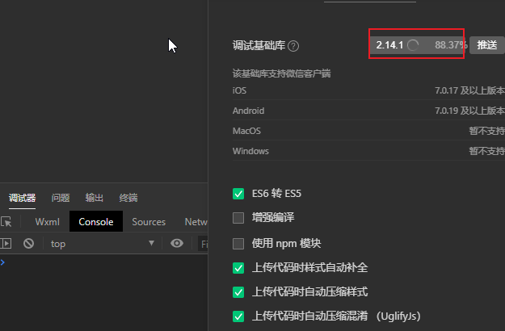

# uniapp

## 注册组件的方式

- kebab-case(短横线命名)
- PascalCase(驼峰命名)

## main.js 文件全局注册组件

```js
import Vue from 'vue'
import pageHead from './components/page-head.vue'
Vue.component('page-head', pageHead)
```

## easycom

传统 vue 组件，需要安装、引用、注册，三个步骤后才能使用组件。easycom 将其精简为一步。 只要组件安装在项目的 components 目录下，并符合 components/组件名称(目录)/组件名称.vue 目录结构(**注意这里一定要目录名和文件名相同才可以**)。就可以不用引用、注册，直接在页面中使用。 如下

```vue
<template>
  <view class="container">
    <uni-list>
      <uni-list-item title="第一行"></uni-list-item>
      <uni-list-item title="第二行"></uni-list-item>
    </uni-list>
  </view>
</template>
<script>
// 这里不用import引入，也不需要在components内注册uni-list组件。template里就可以直接用
export default {
  data() {
    return {}
  }
}
</script>
```

**不管 components 目录下安装了多少组件，easycom 打包后会自动剔除没有使用的组件，类似 tree shaking, 对组件库的使用尤为友好**

**组件库批量安装，随意使用，自动按需打包**

可以通过 v-bind 动态赋值

```vue
<!-- 动态赋予一个变量的值 -->

<blog-post v-bind:title="post.title"></blog-post>

<!-- 包含该 prop 没有值的情况在内，都意味着 `true`。-->
<blog-post is-published></blog-post>

<blog-post v-bind:is-published="post.isPublished"></blog-post>
```

## 单向数据流

所有的 prop 都使得其父子 prop 之间形成了一个单向下行绑定：父级 prop 的更新会向下流动到子组件中，但是反过来则不行。这样会防止从子组件意外变更父级组件的状态，从而导致你的应用的数据流向难以理解。

**每次父级组件发生变更时，子组件中所有的 prop 都将会刷新为最新的值。这意味着你不应该在一个子组件内部改变 prop。如果你这样做了，Vue 会在浏览器的控制台中发出警告。**

## 自定义事件

<https://uniapp.dcloud.io/vue-components?id=%e8%87%aa%e5%ae%9a%e4%b9%89%e4%ba%8b%e4%bb%b6>

## 配置 tabbar

如果应用是一个多 tab 应用，可以通过 tabBar 配置指定的 tab 栏的表现，以及 tab 切换时显示的对应页

- 当设置 position 为 top 时，将不会显示 icon
- tabBar 中的 list 是一个数组，只能配置最少 2 个、最多 5 个 tab，tab 按数组的顺序排序。
- tabbar 切换第一次加载时可能渲染不及时，可以在每个 tabbar 页面的 onLoad 生命周期里先弹出一个等待雪花（hello uni-app 使用了此方式）
- tabbar 的页面展现过一次后就保留在内存中，再次切换 tabbar 页面，只会触发每个页面的 onShow，不会再触发 onLoad。
- 顶部的 tabbar 目前仅微信小程序上支持。需要用到顶部选项卡的话，建议不使用 tabbar 的顶部设置，而是自己做顶部选项卡，可参考 hello uni-app->模板->顶部选项卡。

## 数据请求

```js
uni.request({})
```

## 数据缓存

```js
uni.setStorage({})
uni.setStorageSync({})

uni.getStorage({})
uni.getStorageSync({})

uni.removeStorage({})
uni.removeStorageSync({})

uni.clearStorage({})
uni.clearStorageSync({})
```

## 上传图片

- count 值在 H5 平台的表现，基于浏览器本身的规范。目前测试的结果来看，只能限制单选/多选，并不能限制数量。并且，在实际的手机浏览器很少有能够支持多选的。
- sourceType 在 H5 端对应 input 的 capture 属性，设置为['album']无效，依然可以使用相机。
- 可以通过用户授权 API 来判断用户是否给应用授予相册或摄像头的访问权限https://uniapp.dcloud.io/api/other/authorize
- App 端如需选择非媒体文件，可在插件市场搜索文件选择，其中 Android 端可以使用 Native.js，无需原生插件，而 iOS 端需要原生插件。

## 条件编译

<https://uniapp.dcloud.io/platform>

## 报错信息

### 微信基础库版本过低导致报错





### 无 AppID 关联下,调用 wx.login 受限

<https://blog.csdn.net/qq_38367703/article/details/104911345>

## 组件

### view

视图容器

它类似于传统 html 中的 div，用于包裹各种元素内容

如果使用 nvue，则需要注意，包裹文字应该使用组件

- 如果使用 div，编译时会被转换为 view

#### probrem

- @tab 事件

### icon

- 由于 icon 组件各端表现存在差异，可以通过使用 字体图标 的方式来弥补各端差异

#### 属性说明

| 属性名 | 类型   | 默认值 | 说明                         |
| :----- | ------ | ------ | ---------------------------- |
| type   | String |        | icon 的类型                  |
| size   | Number | 23     | icon 的大小，单位 px         |
| color  | Color  |        | icon 的颜色，同 CSS 的 color |

各平台 type 有效值说明：

| 平台                           | type 有效值                                                                                                                                                     |
| :----------------------------- | --------------------------------------------------------------------------------------------------------------------------------------------------------------- |
| App、H5、微信小程序、QQ 小程序 | success, success_no_circle, info, warn, waiting, cancel, download, search, clear                                                                                |
| 支付宝小程序                   | info, warn, waiting, cancel, download, search, clear, success, success_no_circle,loading                                                                        |
| 百度小程序                     | success, info, warn, waiting, success_no_circle, clear, search, personal, setting, top, close, cancel, download, checkboxSelected, radioSelected, radioUnselect |

### text

- <text> 组件内只支持嵌套 <text>，不支持其它组件或自定义组件，否则会引发在不同平台的渲染差异。
- 在 app-nvue 下，只有<text>才能包裹文本内容。无法在<view>组件包裹文本。
- decode 可以解析的有 &nbsp; &lt; &gt; &amp; &apos; &ensp; &emsp;。
- 各个操作系统的空格标准并不一致。
- 除了文本节点以外的其他节点都无法长按选中。
- 支持 \n 方式换行。
- 如果使用 <span> 组件编译时会被转换为 <text>。

### navigator

该组件类似于 HTML 中的 `<a>` 组件，但只能跳转本地页面。目标页面必须在 pages.json 中注册

#### 注意

- 跳转 tabBar 页面，必须设置 open-type="switchTab", 及跳转到 tabBar 页面，并关闭其他非 tabBar 页面
- navigator-hover 默认为 {background-color: rgba(0, 0, 0, 0.1); opacity: 0.7;}，`<navigator> 的子节点背景色应为透明色`
- app-nvue 平台只有纯 nvue 项目(render 为 native)才支持`<navigator>`。非 render 为 native 的情况下，nvue 暂不支持 navigator 组件，请使用 API 跳转
- app 下退出应用，Android 平台可以使用 [plus.runtime.quit](https://www.html5plus.org/doc/zh_cn/runtime.html#plus.runtime.quit)。IOS 没有退出应用的概念。
- 如果想实现 web 外链跳转，可参考 [uLink 组件](https://ext.dcloud.net.cn/plugin?id=1182)

### scroll-view

可滚动视图区域。用于区域滚动。

**需注意在 webview 渲染的页面中，区域滚动的性能不及页面滚动**

```vue
<template>
  <view>
    <page-head title="scroll-view,区域滚动视图"></page-head>
    <view class="uni-padding-wrap uni-common-mt">
      <view class="uni-title uni-common-mt">
        Vertical Scroll
        <text>\n纵向滚动</text>
      </view>
      <view>
        <scroll-view
          :scroll-top="scrollTop"
          scroll-y="true"
          class="scroll-Y"
          @scrolltoupper="upper"
          @scrolltolower="lower"
          @scroll="scroll"
        >
          <view id="demo1" class="scroll-view-item uni-bg-red">A</view>
          <view id="demo2" class="scroll-view-item uni-bg-green">B</view>
          <view id="demo3" class="scroll-view-item uni-bg-blue">C</view>
        </scroll-view>
      </view>
      <view @tap="goTop" class="uni-link uni-center uni-common-mt"
        >点击这里返回顶部</view
      >

      <view class="uni-title uni-common-mt">
        Horizontal Scroll
        <text>\n横向滚动</text>
      </view>
      <view>
        <scroll-view
          class="scroll-view_H"
          scroll-x="true"
          @scroll="scroll"
          scroll-left="120"
        >
          <view id="demo1" class="scroll-view-item_H uni-bg-red">A</view>
          <view id="demo2" class="scroll-view-item_H uni-bg-green">B</view>
          <view id="demo3" class="scroll-view-item_H uni-bg-blue">C</view>
        </scroll-view>
      </view>
      <view class="uni-common-pb"></view>
    </view>
  </view>
</template>
<script>
export default {
  data() {
    return {
      scrollTop: 0,
      old: {
        scrollTop: 0
      }
    }
  },
  methods: {
    // 滚动到顶部/左边，会触发 scrolltoupper 事件
    upper: function (e) {
      console.log(e)
    },
    // 滚动到底部/右边，会触发 scrolltolower 事件
    lower: function (e) {
      console.log(e)
    },
    // scroll: 滚动时触发
    scroll: function (e) {
      console.log(e)
      this.old.scrollTop = e.detail.scrollTop
    },
    goTop: function (e) {
      // 解决view层不同步的问题
      this.scrollTop = this.old.scrollTop
      this.$nextTick(function () {
        this.scrollTop = 0
      })
      // toast
      uni.showToast({
        icon: 'none',
        title: '纵向滚动 scrollTop 值已被修改为 0'
      })
    }
  }
}
</script>

<style>
.scroll-Y {
  height: 300rpx;
}

.scroll-view_H {
  white-space: nowrap;
  width: 100%;
}

.scroll-view-item {
  height: 300rpx;
  line-height: 300rpx;
  text-align: center;
  font-size: 36rpx;
}

.scroll-view-item_H {
  display: inline-block;
  width: 100%;
  height: 300rpx;
  line-height: 300rpx;
  text-align: center;
  font-size: 36rpx;
}
</style>
```

#### Tips

- APP-vue 和小程序中，请勿在 scroll-view 中使用 map、video 等原生组件。小程序中 scroll-view 中也不要使用 canvas、textarea 原生组件。**更新：微信基础库 2.4.4 起支持了原生组件在 scroll-view、swiper、movable-view 中的使用。app-nvue 无此限制。**
- **scroll-view 不适合放长列表，有性能问题。**长列表滚动和下拉刷新，应该使用原生导航栏搭配页面级的滚动和下拉刷新实现。包括在 app-nvue 页面，长列表应该使用 list 而不是 scroll-view
- scroll-into-view 的优先级高于 scroll-top。
- scroll-view 是区域滚动，不会触发页面滚动，无法触发 pages.json 配置的下拉刷新、页面触底 onReachBottomDistance、titleNView 的 transparent 透明渐变。
- 若要使用下拉刷新，建议使用页面的滚动，而不是 scroll-view 。插件市场有前端模拟的基于 scroll-view 的下拉刷新，但性能不佳。如必需使用前端下拉刷新，推荐使用基于 wxs 的下拉刷新，性能会比基于 js 监听方式更高。
- 如果遇到 scroll-top、scroll-left 属性设置不生效的问题参考：[组件属性设置不生效解决办法](https://uniapp.dcloud.io/vue-api?id=componentsolutions)
- scroll-view 的滚动条设置，可通过 css 的-webkit-scrollbar 自定义，包括隐藏滚动条。(app-nvue 无此 css)

### swiper

滑块视图容器。

一般用于左右滑动或上下滑动，比如 banner 轮播图。

注意滑动切换和滚动的区别，滑动切换是一屏一屏的切换。swiper 下的每个 swiper-item 是一个滑动切换区域，不能停留在 2 个滑动区域之间。

#### Tips

- 使用竖向滚动时，需要给 `<scroll-view>` 一个固定高度，通过 css 设置 height。
- 注意：其中只可放置 `<swiper-item>` 组件，否则会导致未定义的行为。
- 如果遇到 current、current-item-id 属性设置不生效的问题参考：[组件属性设置不生效解决办法](https://uniapp.dcloud.io/vue-api?id=_4-%e7%bb%84%e4%bb%b6%e5%b1%9e%e6%80%a7%e8%ae%be%e7%bd%ae%e4%b8%8d%e7%94%9f%e6%95%88%e8%a7%a3%e5%86%b3%e5%8a%9e%e6%b3%95)
- banner 图的切换效果和指示器的样式，有多种风格可自定义，可在 uni-app 插件市场搜索
- swiper 在 App 的 vue 中、百度支付宝头条 QQ 小程序中，不支持内嵌 video、map 等原生组件。在微信基础库 2.4.4 起和 App nvue2.1.5 起支持内嵌原生组件。竖向的 swiper 内嵌视频可实现抖音、映客等视频垂直拖动切换效果。
- 同时监听 change transition，开始滑动时触发 transition, 放开手后，在 ios 平台触发顺序为 transition... change，Android/微信小程序/支付宝为 transition... change transition...

#### swiper-item

**仅可放置在 `<swiper>` 组件中，宽高自动设置为 100%。注意：宽高 100%是相对于其父组件，不是相对于子组件，不能被子组件自动撑开。**

### image

`<image>` 组件默认宽度 300px、高度 225px；app-nvue 平台，暂时默认为屏幕宽度
src 仅支持相对路径、绝对路径，支持 base64 码；
页面结构复杂，css 样式太多的情况，使用 image 可能导致样式生效较慢，出现 “闪一下” 的情况，此时设置 image{will-change: transform} ,可优化此问题。
自定义组件里面使用 `<image>`时，若 src 使用相对路径可能出现路径查找失败的情况，故建议使用绝对路径。
webp 格式的图片在 Android 上是内置支持的。iOS 上不同平台不一样，具体如下：app-vue 下，iOS 不支持；app-nvue 下，iOS 支持；微信小程序 2.9.0 起，iOS 支持。
svg 格式的图片在不同的平台支持情况不同。具体为：app-nvue 不支持 svg 格式的图片，小程序上只支持网络地址。

## 宽屏适配指南

**uni-app 是以移动为先的理念诞生的。从 uni-app 2.9 起，提供了 PC 等宽屏的适配方案，完成了全端统一。**

PC 适配和屏幕适配略有差异。PC 适配包含宽屏适配和 uni-app 内置组件适配 PC 两方面的工作。

uni-app 内置组件的 PC 适配，又包括 PC 交互习惯的 UI 调整和非 webkit 浏览器适配这两部分。

开发者在 PC 端可以随意使用普通 html 元素和组件，不局限于 uni-app 内置组件。

### uni-app 提供的屏幕适配方案

uni-app 提供的屏幕适配方案，包括 3 部分：

1. 页面窗体级适配方案：leftWindow、rightWindow、topWindow

以目前手机屏幕为主 window，在左右上，可新扩展 leftWindow、rightWindow、topWindow，这些区域可设定在一定屏幕宽度范围自动出现或消失。这些区域各自独立，切换页面支持在各自的 window 内刷新，而不是整屏刷新。

各个 window 之间可以交互通信。

**这套方案是已知的、最便捷的分栏式宽屏应用适配方案。**

- H5 宽屏下 tabBar(选项卡) 与窗体的关系

> 目前做如下调整：leftWindow、rightWindow、topWindow 中有其一存在，则 tabBar 隐藏；不存在，则隐藏。

pages.json 配置样例

```json
{
  "globalStyle": {},
  "topWindow": {
    "path": "responsive/top-window.vue", // 指定 topWindow 页面文件
    "style": {
      "height": "44px"
    }
  },
  "leftWindow": {
    "path": "responsive/left-window.vue", // 指定 leftWindow 页面文件
    "style": {
      "width": 300
    }
  },
  "rightWindow": {
    "path": "responsive/right-window.vue", // 指定 rightWindow 页面文件
    "style": {
      "width": "calc(100vw - 400px)" // 页面宽度
    },
    "matchMedia": {
      "minWidth": 768 //生效条件，当窗口宽度大于768px时显示
    }
  }
}
```

- leftWindow 等方案的使用教程

如果已经有了一个为小屏设计的 uni-app，在使用 leftWindow 等窗体适配大屏时，需理清一个思路：现有的小屏内容，放在哪个 window 里?

如果应用的首页是列表，二级页是详情，此时适合的做法是，将原有的小屏列表作为主 window，在右边扩展 rightWindow 来显示详情。

以新闻示例项目为例，预览地址<https://static-7d133019-9a7e-474a-b7c2-c01751f00ca5.bspapp.com/#/>。这个项目的源码已经内置于 HBuilderX 2.9 中，新建 uni-app 项目时选择新闻/资讯模板。

首先在这个项目的 pages.json 文件中，配置 rightWindow 选项，放置一个新页面 right-window.vue。

```json
// # pages.json
"rightWindow": {
  "path": "responsive/right-window.vue",
  "style": {
    "width": "calc(100vw - 450px)"
  },
  "matchMedia": {
    "minWidth": 768
  }
}
```

rightWindow 对应的页面不需要重写一遍新闻详情的页面逻辑，只需要引入之前的详情页面组件（详情页面/pages/detail/detail 可自动转化为 pages-detail-detail 组件使用）。

```html
<!--responsive/right-window.vue-->
<template>
  <view>
    <!-- 这里将 /pages/detail/detail.nvue 页面作为一个组件使用 -->
    <!-- 路径 “/pages/detail/detail” 转为 “pages-detail-detail” 组件 -->
    <pages-detail-detail ref="detailPage"></pages-detail-detail>
  </view>
</template>

<script>
  export default {
    created(e) {
      //监听自定义事件，该事件由详情页列表的点击触发
      uni.$on('updateDetail', (e) => {
        // 执行 detailPage组件，即：/pages/detail/detail.nvue 页面的load方法
        this.$refs.detailPage.load(e.detail)
      })
    },
    onLoad() {},
    methods: {}
  }
</script>
```

然后在新闻列表页面，处理点击列表后与 rightWindow 交互通信的逻辑。

```js
// pages/news/news-page.nvue
goDetail(detail) {
  if (this._isWidescreen) { //若为宽屏，则触发右侧详情页的自定义事件，通知右侧窗体刷新新闻详情
    uni.$emit('updateDetail', {
      detail: encodeURIComponent(JSON.stringify(detail))
    })
  } else { // 若为窄屏，则打开新窗体，在新窗体打开详情页面
    uni.navigateTo({
      url: '/pages/detail/detail?query=' + encodeURIComponent(JSON.stringify(detail))
    });
  }
},
```

可以看到，无需太多工作量，就可以快速把一个为手机窄屏开发的应用，快速适配为 PC 宽屏应用。并且以后的代码维护，仍然是同一套，当业务迭代时不需要多处升级。

rightWindow 适用于分栏式应用，那 leftWindow 一般用于什么场景?

**leftWindow 比较适合放置导航页面。如果你的应用首页有很多 tab 和宫格导航，那么可以把它们重组，放在 leftWindow 作为导航。之前在手机竖屏上依靠多级 tab 和宫格导航的场景，可以在 leftWindow 里通过 tree 或折叠面板方式导航。**

**leftWindow 除了适用于手机应用适配大屏，也适用于重新开发的 PC 应用，尤其是 PC Admin 管理控制台。**

2. 组件级适配方案：match-media 组件

**leftWindow 等方案是页面窗体级适配方案。适于独立的页面。那么在同一个页面中，是否可以适配不同屏宽? 当然可以，此时可以使用组件级适配方案。**

uni-app 提供了 [match-media 组件](https://uniapp.dcloud.net.cn/component/match-media) 和配套的 [uni.createMediaQueryObserver](https://uniapp.dcloud.net.cn/api/ui/media-query-observer) 方法。

**这是一个媒体查询适配组件，可以更简单的用于动态屏幕适配。**

**在 match-media 组件中放置内容，并为组件指定一组 media query 媒体查询规则，如屏幕宽度。运行时，如屏幕宽度满足查询条件，这个组件就会被展示，反之则隐藏。**

- match-media 组件的优势包括：

- - 开发者能够更方便、显式地使用 Media Query 能力，而不是耦合在 CSS 文件中，难以复用。
- - 能够在模板中结合数据绑定动态地使用，不仅能做到组件的显示或隐藏，在过程式 API 中可塑性更高，例如能够根据尺寸变化动态地添加 class 类名，改变样式。
- - 能够嵌套式地使用 Media Query 组件，即能够满足局部组件布局样式的改变。
- - 组件化之后，封装性更强，能够隔离样式、模版以及绑定在模版上的交互事件，还能够提供更高的可复用性。

media query 匹配检测节点。

**类似于网页开发中使用媒体查询来适配大屏小屏，match-media 是一个可适配不同屏幕的基本视图组件。可以指定一组 media query 媒体查询规则，满足查询条件时，这个组件才会被展示。**

例如在 match-media 组件中放置一个侧边栏，媒体查询规则设置为宽屏才显示，就可以实现在 PC 宽屏显示该侧边栏，而在手机窄屏中不显示侧边栏的效果。

平台兼容性

| app              | 微信小程序     | 支付宝小程序 | qq 小程序 | 百度小程序 | 字节小程序 | 360 小程序 | 快应用 |
| :--------------- | -------------- | ------------ | --------- | ---------- | ---------- | ---------- | ------ |
| 2.8.12+，app-vue | 基础库 2.11.1+ | √            | √         | √          | √          | √          | ×      |

**注意：支付宝小程序、qq 小程序、百度小程序、字节小程序，暂不支持监听屏幕动态改变，即只执行一次媒体查询。**

[属性说明](https://uniapp.dcloud.net.cn/component/match-media)

match-media 示例

以下示例代码，推荐使用 HBuilderX，新建 uni-app 项目，可直接体验完整示例。

**注意， match-media 放置在 right-window 等里面不生效**

```html
<template>
  <view>
    <match-media :min-width="375" :max-width="800">
      <view>当页面最小宽度 375px， 页面宽度最大 800px 时显示</view>
    </match-media>

    <match-media :min-height="400" :orientation="landscape">
      <view>当页面高度不小于 400px 且屏幕方向为纵向时展示这里</view>
    </match-media>
  </view>
</template>
```

当然，开发者也可以继续使用 css 媒体查询来适配屏幕，或者使用一些类似 mobilehide、pcshow 之类的 css 样式。

**uni-app 的屏幕适配推荐方案是运行时动态适配，而不是为 PC 版单独条件编译（虽然您也可以通过自定义条件编译来实现单独的 PC 版）。这样设计的好处是在 ipad 等设备的浏览器上可以方便的横竖屏切换。**

3. 内容缩放拉伸的处理

**除了根据屏宽动态显示和隐藏内容，其实还有一大类屏幕适配需求，即：内容不会根据屏宽动态显示隐藏，而是缩放或拉伸。**

具体来说，内容适应又有两种细分策略：

- 局部拉伸：页面内容划分为固定区域和长宽动态适配区域，固定区域使用固定的 px 单位约定宽高，长宽适配区域则使用 flex 自动适配。当屏幕大小变化时，固定区域不变，而长宽适配区域跟着变化
- 等比缩放：根据页面屏幕宽度缩放。rpx 其实属于这种类型。在宽屏上，rpx 变大，窄屏上 rpx 变小。

举个实际的例子，比如一个列表页面，左边有一个图标，右边是 2 行文字。

如果使用策略 1，即局部拉伸，那么左边的图标部分固定一个宽高，右边的 2 行文字的大小也固定，但 2 行文字的宽度自适应，占满屏幕右侧的空间。也就是屏宽宽度变化后，只有 2 行文字的宽度在变化，其他一切不变。
如果使用策略 2，即等比缩放，那么整个列表均使用 rpx，在宽屏上，图标变大、右边的 2 行文字变大，列表项行高变大。而在窄屏上，一切又都变小。
策略 2 省事，设计师按 750px 屏宽出图，程序员直接按 rpx 写代码即可。但策略 2 的实际效果不如策略 1 好。程序员使用策略 1，分析下界面，设定好局部拉伸区域，这样可以有更好的用户体验。

这里需要对 rpx 的使用特别强调一下。

在移动设备上也有很多屏幕宽度，设计师一般只会按照 750px 屏幕宽度出图。此时使用 rpx 的好处在于，各种移动设备的屏幕宽度差异不是很大，相对于 750px 微调缩放后的效果，尽可能的还原了设计师的设计。

但是，一旦脱离移动设备，在 pc 屏幕，或者 pad 横屏状态下，因为屏幕宽度远大于 750 了。此时 rpx 根据屏幕宽度变化的结果就严重脱离了预期，大的惨不忍睹。

为此，在 uni-app 2.9+起，新增了 rpx 按 750px 做基准屏宽的生效范围控制，并且将 rpx 的默认最大适配宽度设为了 960 px。

也就是设计师按 750px 出具的设计图，可适配的最大屏幕宽度为 960px，在这个范围内，rpx 可以根据屏幕宽度缩放。一旦超过 960，rpx 再根据屏幕宽度缩放就变的没有意义了。按如下配置，在超过 960 宽的屏幕上，会按 375px 作为基准宽度，这是最大程度上保持界面不失真的策略。

当然这些配置您都可以自己定义调整，在 pages.json 的 globeStyle 里配置 rpx 的如下参数。

```json
{
  "globalStyle": {
    "rpxCalcMaxDeviceWidth": 960, // rpx 计算所支持的最大设备宽度，单位 px，默认值为 960
    "rpxCalcBaseDeviceWidth": 375, // rpx 计算使用的基准设备宽度，设备实际宽度超出 rpx 计算所支持的最大设备宽度时将按基准宽度计算，单位 px，默认值为 375
    "rpxCalcIncludeWidth": 750 // rpx 计算特殊处理的值，始终按实际的设备宽度计算，单位 rpx，默认值为 750
  }
}
```

通过上述配置中的前 2 个，即 rpxCalcMaxDeviceWidth 和 rpxCalcBaseDeviceWidth，即可有效解决使用了 rpx 后，在宽屏下界面变的奇大无比的问题。如果你不需要特别定义这 2 个参数的数值，则无需在 pages.json 中配置它们，保持默认的 960 和 375 即可。

但是，rpx 的最大适配宽度被限定后，会带来一个新问题：如果您的代码中把 750rpx 当做 100%来使用（官方强烈不推荐这种写法，即便是 nvue 不支持百分比，也应该使用 flex 来解决撑满问题），此时不管屏幕宽度为多少，哪怕超过了 960px，您的预期仍然是要占满整个屏幕宽度，但如果按 rpxCalcBaseDeviceWidth 的 375px 的策略执行将不再占满屏宽。

此时您有两种解决方案，一种是修改代码，将里面把 rpx 当做百分比的代码改掉；另一种是配置 rpxCalcIncludeWidth，设置某个特定数值不受 rpxCalcMaxDeviceWidth 约束。如上述例子中的"rpxCalcIncludeWidth": 750，代表着如果写了 750rpx，始终将按屏幕宽度百分百占满来计算。

- 关于 rpx 转 px

不少开发者之前对 rpx 的使用过于没有节制，后来为了适配宽屏，想要改用“局部拉伸：页面内容划分为固定区域和长宽动态适配区域”的策略，此时将回归 px。

比如 [DCloud 社区的宽屏适配示例](https://static-1afcc27f-ce2f-4a6d-9416-c65a6f87d24e.bspapp.com/#/)和[新闻模板](https://static-7d133019-9a7e-474a-b7c2-c01751f00ca5.bspapp.com/)都没有使用 rpx。

如果想把 rpx 转 px，可以在源码里正则替换，也可以使用三方已经写好的单位转换库。下面介绍下三方库的用法。

项目根目录新增文件 postcss.config.js，内容如下。则在编译时，编译器会自动转换 rpx 单位为 px。

如果想把 rpx 转 px，可以在源码里正则替换，也可以使用三方已经写好的单位转换库。下面介绍下三方库的用法。

项目根目录新增文件 postcss.config.js，内容如下。则在编译时，编译器会自动转换 rpx 单位为 px。

**注意：将 rpx 作为百分比的用法需要手动处理**

```js
// postcss.config.js

const path = require('path')
module.exports = {
  parser: 'postcss-comment',
  plugins: {
    'postcss-import': {
      resolve(id, basedir, importOptions) {
        if (id.startsWith('~@/')) {
          return path.resolve(process.env.UNI_INPUT_DIR, id.substr(3))
        } else if (id.startsWith('@/')) {
          return path.resolve(process.env.UNI_INPUT_DIR, id.substr(2))
        } else if (id.startsWith('/') && !id.startsWith('//')) {
          return path.resolve(process.env.UNI_INPUT_DIR, id.substr(1))
        }
        return id
      }
    },
    autoprefixer: {
      overrideBrowserslist: ['Android >= 4', 'ios >= 8'],
      remove: process.env.UNI_PLATFORM !== 'h5'
    },
    // 借助postcss-px-to-viewport插件，实现rpx转px，文档：https://github.com/evrone/postcss-px-to-viewport/blob/master/README_CN.md
    // 以下配置，可以将rpx转换为1/2的px，如20rpx=10px，如果要调整比例，可以调整 viewportWidth 来实现
    'postcss-px-to-viewport': {
      unitToConvert: 'rpx',
      viewportWidth: 200,
      unitPrecision: 5,
      propList: ['*'],
      viewportUnit: 'px',
      fontViewportUnit: 'px',
      selectorBlackList: [],
      minPixelValue: 1,
      mediaQuery: false,
      replace: true,
      exclude: undefined,
      include: undefined,
      landscape: false
    },
    '@dcloudio/vue-cli-plugin-uni/packages/postcss': {}
  }
}
```

- 非 webkit 浏览器适配

uni-app 理论上不限定浏览器。在 HBuilderX 2.9 发版时，就新闻示例项目，在 chrome、Safari、firefox、edge 的最新版上均测试过，可以正常使用。

一般国内的浏览器，如 360 浏览器、搜狗浏览器，均支持 chrome 内核，只要版本够新，应该都可以访问。

如果你的应用在其他 PC 浏览器下异常，请检查自己代码的浏览器兼容问题。

如果你发现了 uni-app 框架层面、内置组件有浏览器兼容问题，欢迎在 github 上给我们提交 pr。

一般情况下，只要基础框架没有浏览器兼容问题，那么组件层面的问题也可以通过更换组件来解决。当 uni-app 编译到 PC 浏览器端时，支持所有的 vue 组件，包含那些操作了 dom、window 的 ui 库，比如 elementUI 等。

- 通过 electron 打包为 windows、mac、linux 客户端

有了宽屏适配，uni-app 的应用就可以方便的通过 electron 打包为电脑客户端应用，windows、mac、linux 均支持。

开发者可以随意调用 electron 的 API，以调用更多操作系统的能力（为方便多端兼容，可以将这些特殊 API 写在自定义的条件编译里）

插件市场有已经封装好的一些插件，[详见](https://ext.dcloud.net.cn/search?q=electron)
